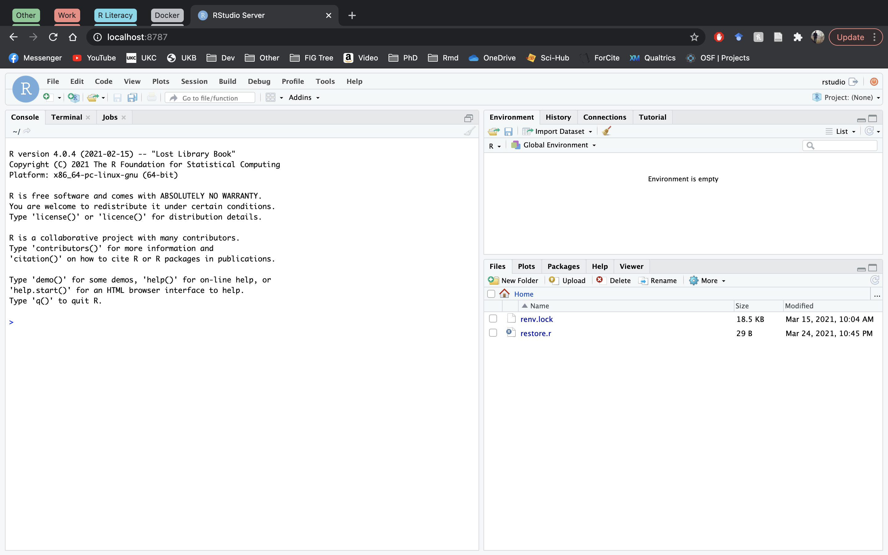
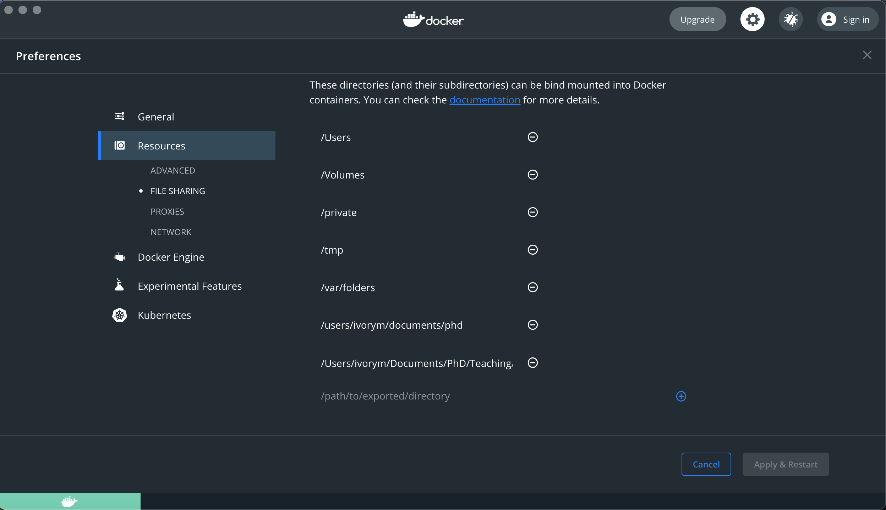

```{r knitr_init, echo = FALSE, cache = FALSE, include = FALSE}
library(knitr)

## Global options
options(max.print = "75")
opts_chunk$set(cache = TRUE,
               prompt = FALSE,
               tidy = TRUE,
               comment = "> #",
               message = FALSE,
               warning = FALSE)
opts_knit$set(width = 75)
```

## Lesson Objectives

- Launch RStudio inside of a Docker container
- Linking a volume to a Docker container
- Load into the container plotting it

## Installation

First things first: [install Docker](https://docs.docker.com/get-docker/). The links will take you to the necessary version for either Mac, Windows or Linux. Requirements may vary depending on your operating system. This tutorial has been tested and written using Mac Big Sur as the environment.

## Launching RStudio in Docker

You can see that Docker is installed and ready to launch by opening up the docker.app available in the Applications folder. Alternatively, you can type `docker` into the terminal. The tutorial will take place both using the terminal and occasionally the Docker app. All that can be done in the app can be done in the terminal, but not necessarily vice versa. Some commands are better recording a copy of the text command, some others are easier in the GUI of the app.

If you get the error *Cannot connect to the Docker daemon. Is the docker daemon running on this host?* at some point in the tutorial, running the following command might fix your problem:

~~~
eval "$(docker-machine env default)"
~~~


Next, we will ask Docker to run an image that already exists, we will use the *verse* Docker image from [Rocker](https://github.com/rocker-org/rocker/wiki) which will allow us to run RStudio inside the container with additional attached packages. Rocker provides various RStudio images with various packages already attached. All their available images can be found [here](https://hub.docker.com/r/rocker).

~~~
docker run --rm -e PASSWORD=pass -p 8787:8787 rocker/verse
~~~

Optional:
*`p`, `e` and `--rm` are flags that allow you to customize how you run the container. `p` tells Docker that you will be using a port to see RStudio in your web browser (at a location which we specify afterwards as port `8787:8787`). `e` allows us to set environment variables, but in our case we use it to set a password which is mandated by Docker. If you do not specify a password, Docker throws a warning but the default password is "rstudio", same as the username. Finally, `--rm` ensures that when we quit the container, the container is deleted. If we did not do this, every time we run a container, a version of it will be saved to our local computer. This can lead to the eventual wastage of a lot of disk space until we manually remove these containers. Later we will show you how to save your container if you want to do so.

If you try to run a Docker container which you have not installed locally then Docker will automatically search for the container on Docker Hub (an online repository for docker images) and download it if it exists.*

The command above will lead RStudio-Server to launch invisibly. To connect to it, open a browser and enter `localhost:8787`. This may be different on Windows machines, and as yet untested but I believe this may be the same still.

This should lead to you being greeted by the RStudio welcome screen. Log in using:

username: rstudio

password: pass (which was set above in the terminal command, this can be changed obviously, but for a local instance the security of the password is not tantamount.)

Now you should be able to work with RStudio in your browser in much the same way as you would on your desktop.

The image below shows RStudio server running within a docker image. You should see something similar on your machine.



Try to now look at your files of your virtual computer (docker container). Go to
file -> open file. You will see that there are actually no files. The reason for
this is that this image came with no files.
Next, open a new R Script, e.g. by going to file -> New file -> R Script. 
Enter the following code in the script, run it and save it.

~~~
# make x the numbers from 1 to 5, and y the numbers from 6-10
x <- 1:5
y <- 6:10

# plot x against y
plot(x, y)
~~~

If you look at your files again now, you will see the script file.

Now, given that we used the `--rm` flag when we launched the Docker container, anything we create on the machine will be removed. Let's verify this. First, close the browser tab where you have RStudio open, and then go to your terminal window from where you launched the Docker container and press Control+C. Alternatively, you can stop the container running vias the app interface by clicking the stop button against the relevant container. This shuts down the Docker container.

Now relaunch the same Docker container using the RStudio image as you did previously, e.g., `docker run --rm -e PASSWORD=pass -p 8787:8787 rocker/verse` in the terminal and navigating back to the container in your browser window and see if the rscript and plot you saved is still there.


## Linking a volume to a Docker container to access data and save files

That leads us to the question of, how can we save our work if the container is deleted when we exit the container? One solution is to link a volume (for example your local hard drive) to the container so that you can access the data there as well as being able to save things there.

This time when we launch our container we will use the `-v` flag along with the path to our project's root directory. Your launch command should look something like this, although the path will differ depending on where you saved the data to on your computer. On the left hand side of the `:` is the path
on your own computer and the folder that you want to connect. On the right hand side is the path on the container; this should almost always start with `/home/rstudio/` otherwise it will not link properly in the container. 

You may find that you need to specify access to the local directory before it allows you connect the volumes. Then is easily done using the GUI, by going to the settings icon>resources>file sharing and entering the pathfile for the folder you wish to attach. This ensures that Docker does not access files it should not be accessing.




So it should look something like the below. Note that everything on the terminal is lowercase, docker does not process capitals well (and would likely throw an error) and so these need to be removed otherwise it will throw an error.


~~~
docker run --rm -p 8787:8787 -v /Users/ivorym/r-docker-tutorial:/home/rstudio/r-docker-tutorial rocker/verse
~~~

So to break the above command down, we start by saying we are running the process using `docker` and the command `run`, we then specify the flag `--rm` to ensure that the container is deleted at the end. `-p 8787:8787` specifies the port we want to use, then the flag `-v` and the `"local folder":/home/rstudio/r-docker-tutorial` specifies the local folder we want to be accessible in the container. Finally we specifiy the image we want to load up with `rocker/verse`. Later we will create our own image.

Again, you will have to enter something like `http://localhost:8787` in your browser as the URL to get RStudio to run. 

This time when you launch RStudio in the Docker container and you try to open a file you should be able to see some files and directories. Now set the working directory to the directory called `r-docker-tutorial` and load the `gapminder-FiveYearData.csv` into R via `read.table`.

~~~
# load gapminder data from a csv on your computer
gap5yr <- read.csv(file = 'data/gapminder-FiveYearData.csv')
~~~

Now lets plot GDP per capita against  life expectancy.

~~~
# load ggplot library
library(ggplot2)

# plot GDP against  life expectancy
qplot(gap5yr$lifeExp, gap5yr$gdpPercap)

# save the plot
ggsave(filename = 'data/GDP_LifeExp.pdf')
~~~

Let's also save the script as `plot_GDP_LifeExp.R` in the `r-docker-tutorial` directory. Now close the RStudio browser and exit your Docker container via the terminal using Control+C. Then look inside the `r-docker-tutorial` and `r-docker-tutorial/data` directories on your laptop to see if you can see the two files you created.

## Summary

In this lesson we learned how to launch a Docker container that allows us to run RStudio in a browser. We learned that using the `--rm` flag when we run Docker makes the container ephemeral; meaning that it is automatically deleted after we close the container. We do this so we do not build up a large collection of containers on our machine and waste space. We also learned that we can link a volume of our laptop to the Docker container if we want to be able to access and save data, scripts and any other files. 

The container we used already had R, RStudio and several useful R packages installed. In later lessons we will learn how to modify this container to install new packages, and where we can find other Docker containers that might be useful for our work.

Take a second to reflect upon what has been achieved so far and the implications for open science. We have spun up an isolated container with RStudio, with packages preinstalled (note in the last code section we did not have to install ggplot2, it was preloaded!) and data ready to be used. What else could be stored in a container to allow for reproduction of results?

Next: Go to [Lesson 03 Install packages](03-install-packages.html) or back to the 
[main page](http://ropenscilabs.github.io/r-docker-tutorial/).

