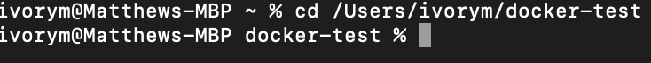
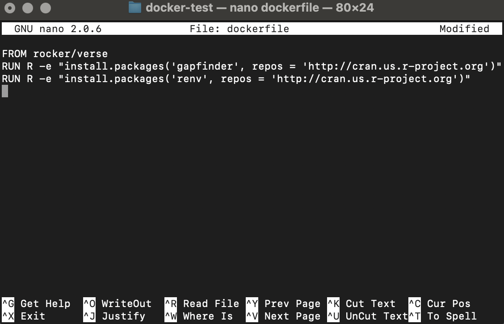

```{r knitr_init, echo = FALSE, cache = FALSE, include = FALSE}
library(knitr)

## Global options
options(max.print = "75")
opts_chunk$set(cache = TRUE,
               prompt = FALSE,
               tidy = TRUE,
               comment = "> #",
               message = FALSE,
               warning = FALSE)
opts_knit$set(width = 75)
```

Earlier, we got started with a base image that let us run RStudio from within Docker, and learned to modify the contents of that image using `docker commit`. This is an excellent technique for capturing what we've done so we can reproduce it later, but what if we want to be able to easily change the collection of things in our image, and have a clear record of just what went into it? This is useful when maintaining running environments that may change and evolve over a project, and is facilitated by Dockerfiles. 

In the context of reproducibility, we can create our own Dockerfiles with the necessary files and packages needed for reproducing results. Instead of sending someone R scripts and data and leaving them to figure out the setting up on their environment to match yours, why not just pass them a Docker image that has the packages and files ready set up? Analogous to simply letting them sit at your computer and running the results for themselves!

Dockerfiles are a set of instructions on how to add things to a base image. They build custom images up in a series of *layers*.

In this lesson, we will create a Dockerfile, install packages and attach some files ready for someone else to use. Much of this process is best done via the terminal. THis can look complex and serious business, but is relatively straight-forward. Create a new folder called "docker-test" somewhere useful on your local machine (there are a number of ways to achieve thus, either via Finder or via the terminal, I leave this to you). We then want to access this folder in the terminal, open terminal and then type in cd followed by the filepath for the folder:

```
cd Users/ivorym/docker-test
```

Then to create the dockerfile, we type `nano dockerfile` which creates and opens a file called dockerfile in the folder. We then need to create the image. To do so, we write the following on the first line"


```
FROM rocker/verse:latest
```

This tells Docker to start with the `rocker/verse` base image - that's what we've been using so far. 
The `FROM` command must always be the first thing in your Dockerfile; this is the bottom crust of the pie we are baking.

Next, let's add the package gapfinder as another layer on top of our base, in order to have `gapminder` pre-installed and ready to go:

```
RUN R -e "install.packages('gapminder', repos = 'http://cran.us.r-project.org')"
```

`RUN` commands in your Dockerfile execute shell commands to build up your image, like putting the filling in our pie. In this example, we install `gapminder` from the command line using `install.packages`, which does the same thing as if we had done `install.packages('gapminder')` from within RStudio. We can include as many `RUN` commands as we like, so perhaps we want to pre-install the package renv too?

```
RUN R -e "install.packages('renv', repos = 'http://cran.us.r-project.org')"
```



Save your Dockerfile (by pressing Control + X and then pressing y, then enter), and return to your docker terminal; we have now created our first dockerfile!

We can now use this file to build our image by typing the command:

```
docker build -t my-r-image .
```

`-t my-r-image` gives our image a name (note image names are always all lower case), and the `.` says all the resources we need to build this image are in our current directory. List your images via:

```
docker images
```

and you should see `my-r-image` in the list. Launch your new image similarly to how we launched the base image:

```
docker run --rm -e PASSWORD=pass -p 8787:8787 my-r-image
```

Then in the RStudio terminal, try gapminder or renv again:

```
library('gapminder')
gapminder
```

And there it is - two packages, gapfinder and renv, are pre-installed and ready to go in your new docker image. 

Our hypothetical pie is almost complete! All we need to finish  is the topping. In addition to R packages like gapminder, we may also want some some static files inside our Docker image - such as data. We can do this using the `ADD` command in your Dockerfile:

```
ADD data/gapminder-FiveYearData.csv /home/rstudio/
```

Make sure that you specified the images folder as `/home/rstudio/` as the minimum, otherwise you will not see the data!

Rebuild your Docker image:

```
docker build -t my-r-image .
```

And launch it again:

```
docker run --rm -p 8787:8787 my-r-image
```

Go back to RStudio in the browser, and there `gapminder-FiveYearData.csv` will be, present in the files visible to RStudio. In this way, we can capture files as part of our Docker image, so they're always available along with the rest of our image in the exact same state.

#### Protip: Cached Layers

While building and rebuilding your Docker image in this tutorial, you may have noticed lines like this:
```
Step 2 : RUN R -e "install.packages('gapminder', repos = 'http://cran.us.r-project.org')"
 ---> Using cache
 ---> fa9be67b52d1
```
Noting that a cached version of the commands was being used. When you rebuild an image, Docker checks the previous version(s) of that image to see if the same commands were executed previously; each of those steps is preserved as a separate layer, and Docker is smart enough to re-use those layers if they are unchanged and *in the same order* as previously. Therefore, once you've got part of your setup process figured out (particularly if it's a slow part), leave it near the top of your Dockerfile and don't put anything above or between those lines, particularly things that change frequently; this can substantially speed up your build process. 

## Summary

In this lesson, we learned how to compose a Dockerfile so that we can re-create our images at will. We learned three main commands:

 - `FROM` is always at the top of a Dockerfile, and specifies the image we want to start from.
 - `RUN` runs shell commands on top of our base image, and is used for doing things like downloads and installations.
 - `ADD` adds files from our computer to our new Docker image.

The image is built by running `docker build -t my-r-image .` in the same directory as our Dockerfile and any files we want to include with an `ADD` command.

Go to [Lesson 06 Share all your analysis](06-Sharing-all-your-analysis.html) or back to the  
[main page](http://ropenscilabs.github.io/r-docker-tutorial/).
