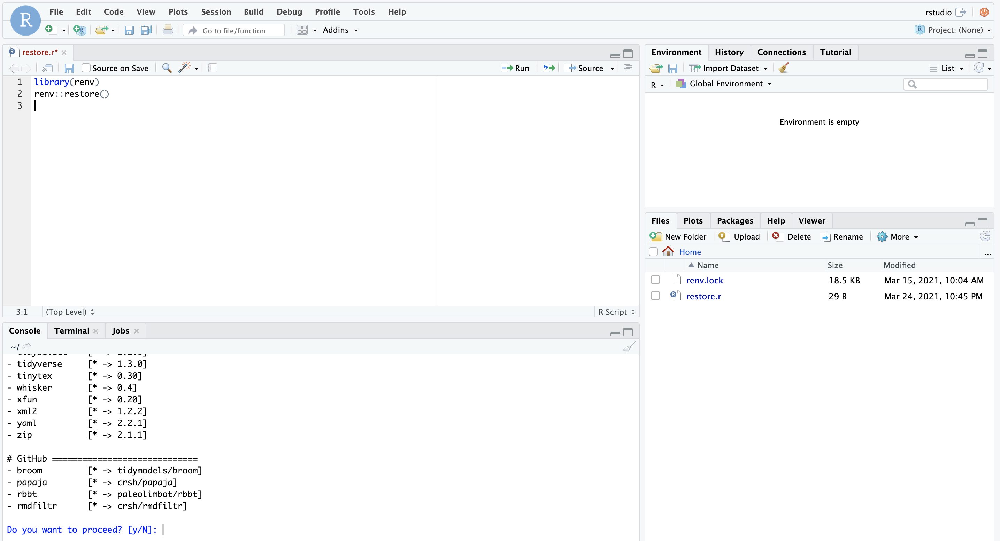
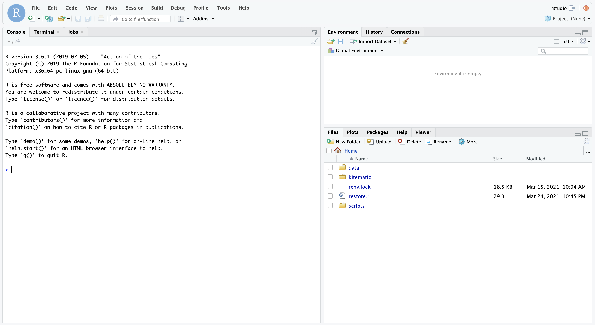

```{r knitr_init, echo = FALSE, cache = FALSE, include = FALSE}
library(knitr)

## Global options
options(max.print = "75")
opts_chunk$set(cache = TRUE,
               prompt = FALSE,
               tidy = TRUE,
               comment = "> #",
               message = FALSE,
               warning = FALSE)
opts_knit$set(width = 75)
```
## Optional
This section can be deemed optional and read but not practiced. It is solely an example of how one may wish to consider using Docker within a workflow.


##Using renv with Docker
As an extension to the previous tutorials, where we have successfully installed Docker, created a container from the Rocker/verse image, attached volumes, and created our own image, we can now think about incorporating this into a workflow for reproducible research. Would it not be great, as mentioned in a previous page, how we can provide someone with a Docker image ready to go.

Ideally we do not want to be doubling our work by first setting up our own R environment locally, and then tediously copying all the necessary packages into a dockerfile to create the image. One way to potentially reduce the work required is to use a basic dockerfile that only attaches one new package and a couple of necessary files is with the use of the R package [renv](https://rstudio.github.io/renv/articles/renv.html). You may have noticed we loaded this into our docker image previously!

Now, without going into another tutorial for renv, which is very well described at the above link, it allows us to take a snapshot of our R environment and the packages used in a research project. This allows us to isolate the package versions as they were used in the project, reducing issues of versioning when people try to replicate.

So, skipping the setup procesdure of renv (left to your own reading), with the inclusion of two files and a minor tweak to an existing line in our dockerfile, we can allow others to access the exact same environment that we used. How cool!

In tutorial six, we specified the R version in the dockerfile, here we do the same thing to ensure it matches the version of R used during the project and we alter the dockerfile to reflect this. In RStudio, we can use the command `version` which will tell us which tag we need to specify when importing the base image into our dockerfile:

```
FROM rocker/verse:3.6.1

```

We can keep the RUN commands as previously entered:

```
RUN R -e "install.packages('gapfinder', repos = 'http://cran.us.r-project.org')"
RUN R -e "install.packages('renv', repos = 'http://cran.us.r-project.org')"
```

But now we add one new line, where we add a folder in `data/renv` that holds a two-line R script called restore.r and a renv lock file:

```
ADD data/renv/ /home/rstudio/
```

We can now build this image, with a familiar command:

```
docker build -t my-reproducible-image .
```

Then we can 'spin up' a container from this image and check it out:

```
docker run --rm -e PASSWORD=pass -p 8787:8787 my-reproducible-image
```

When we navigate to localhost:8787 in our browser and log in, we should see two new items, the lock file and an R script. If we open restore.r and run it, we should be asked if we want to proceed with either installing packages and back-versioning other packages. This allows someone to recreate our environment with all the correct package versions easily and without ourselves creating a complex dockerfile.



All that is left to do is add additional lines to our dockerfile, where we add the scripts and data needed for the complete project. How you do this is up to you, but follows the same idea of adding a line into the dockerfile with `ADD`. Perhaps we store all our scripts in a folder called `R` and a data folder called `data`. We can add these to the dockerfile with two lines

```
ADD data/rawdata/ /home/rstudio/data
ADD data/scripts/ /home/rstudio/scripts
```
Other possible ways of integrating data into a dockerfile could be by including a RUN line that git clones a repository where the data is stored. This is not currently explored within this tutorials, and left to the reader's own curiosity.

Build this image and spin it up, you should have an easily reproducible docker image that can be used by anyone else.



In the second tutorial we considered how Docker could fit into a reproducible workflow, and now we have the answer. Incorporating this into your current working way does not take a huge leap, some basic terminal use and a docker account can allow you to share the exact environment used in your project. With careful use of setting seeds in your scripts and managing folder structure, anyone can perform the same analyses that you did, with some basic Docker understanding of their own!

This tutorial is a forked and developed version from [Ropenscilabs](http://ropenscilabs.github.io/r-docker-tutorial/), so many thanks to their original work.